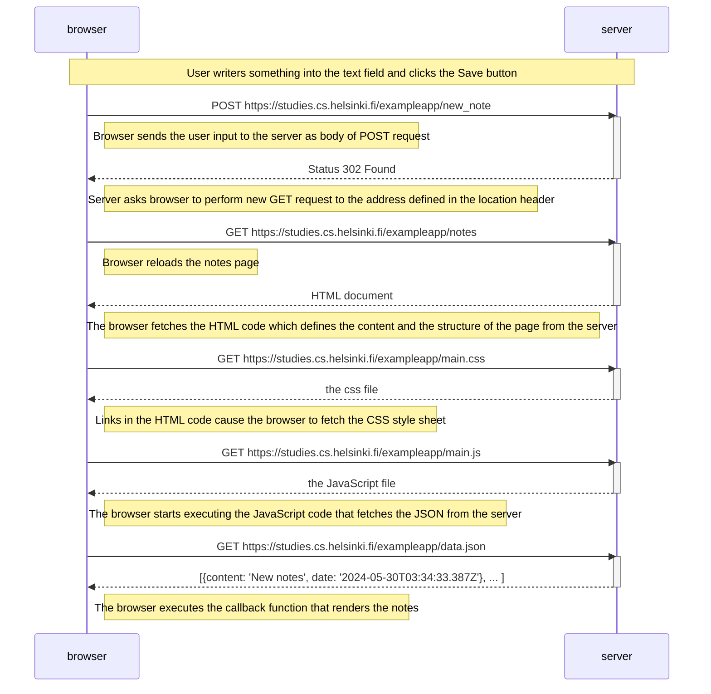

0.4: New note diagram- situation where the user creates a new note by writing something into the text field and clicking the Save button.

```mermaid
sequenceDiagram
    participant browser
    participant server

    Note over browser, server: User writers something into the text field and clicks the Save button

    browser->>server: POST https://studies.cs.helsinki.fi/exampleapp/new_note
    activate server
    Note right of browser: Browser sends the user input to the server as body of POST request
    server-->>browser: Status 302 Found
    deactivate server
    Note right of browser: Server asks browser to perform new GET request to the address defined in the location header

    browser->>server: GET https://studies.cs.helsinki.fi/exampleapp/notes
    activate server
    Note right of browser: Browser reloads the notes page
    server-->>browser: HTML document
    deactivate server
    Note right of browser: The browser fetches the HTML code which defines the content and the structure of the page from the server

    browser->>server: GET https://studies.cs.helsinki.fi/exampleapp/main.css
    activate server
    server-->>browser: the css file
    deactivate server
    Note right of browser: Links in the HTML code cause the browser to fetch the CSS style sheet

    browser->>server: GET https://studies.cs.helsinki.fi/exampleapp/main.js
    activate server
    server-->>browser: the JavaScript file
    deactivate server
    Note right of browser: The browser starts executing the JavaScript code that fetches the JSON from the server

    browser->>server: GET https://studies.cs.helsinki.fi/exampleapp/data.json
    activate server
    server-->>browser: [{content: 'New notes', date: '2024-05-30T03:34:33.387Z'}, ... ]
    deactivate server
    Note right of browser: The browser executes the callback function that renders the notes
```